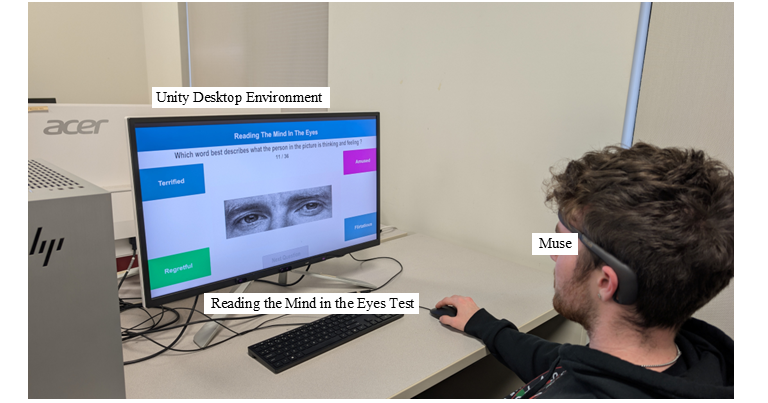

# Feedback Effects on Cognitive Dynamics

This repository contains the codes for analyzing the Reading the Mind in the Eyes Test (RMET) with EEG data and network-based learning analytics methods.

The study investigates how feedback influences cognitive dynamics by combining EEG recordings and performance data. Participants completed the RMET while wearing a Muse EEG headband (channels: AF7, AF8, TP9, TP10). Two counterbalanced conditions were compared:

1)Feedback condition: participants received immediate feedback after each response.

2)No-feedback condition: no cue was provided.

We apply Epistemic Network Analysis (ENA) and Ordered Network Analysis (ONA) to explore how EEG patterns and performance measures interact under these conditions.
This repository includes scripts for EEG preprocessing, ENA, and ONA networks generation.
